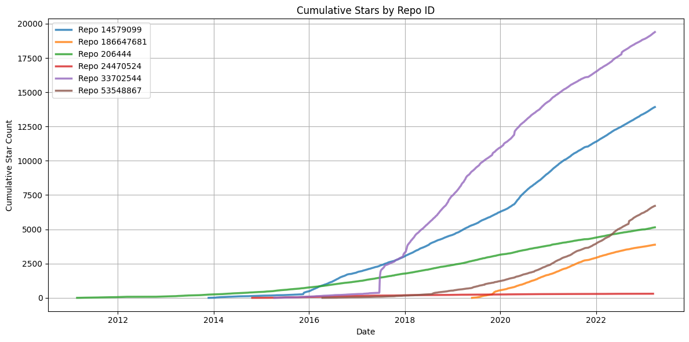
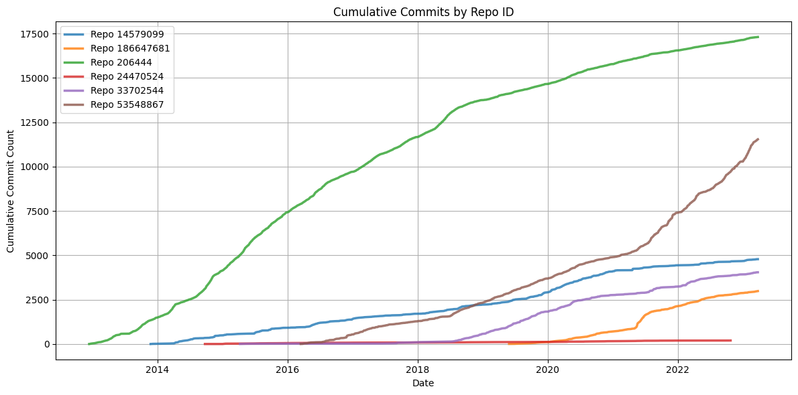

## Project Overview
The primary purpose of this project is to build a streamlined solution for monitoring GitHub repository activity, enabling users to track key metrics such as repository growth, stars, and commits. This data engineering project is particularly valuable for developers assessing project popularity and open-source maintainers seeking insights into their projects' engagement. By providing an efficient platform for analyzing the open-source ecosystem, this project empowers users to make informed, data-driven decisions about repository activity.

## Insights 
These insights aim to provide a comprehensive understanding of repository dynamics, helping users identify opportunities for collaboration, investment, or improvement in their own projects.

1. Identification of Fast-Growing Repositories 
- Focuses on tracking metrics like stars and forks to uncover repositories that are rapidly gaining popularity within the open-source ecosystem.

2. Analysis of a Specific Repository 
- Detailed examination of a repository's metrics and activities, such as commit frequency and contributor engagement, to evaluate its overall health and performance.

## Key Metrics

1. Growth rate of stars
📈 Measures the increase in the number of stars a repository receives over time to gauge its popularity

2. Growth rate of commits
🐾 Tracks the frequency of commits made to a repository, reflecting the activity level and development pace

3. Custom Analysis 
📝 Provides tailored insights based on specific user-defined parameters or metrics relevant to individual repositories

## Frequency 
**Daily**: Daily updates are preferred to ensure that users have access to the most current metrics and trends for active monitoring of repository activity

## Models
**SQL Database Format**: The data should be delivered in a structured format suitable for SQL databases, such as CSV or JSON, which can easily be imported and queried for analysis
